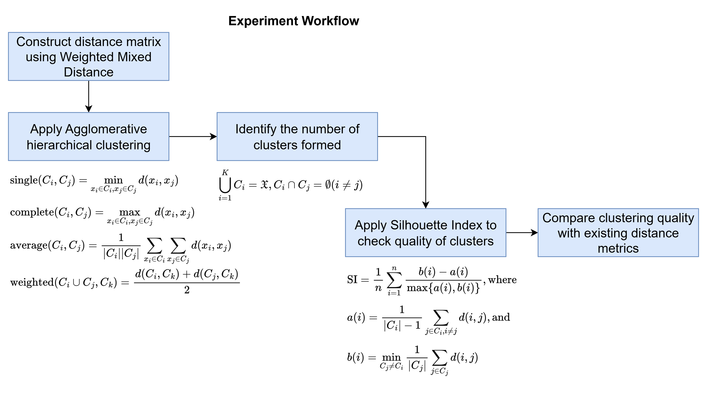
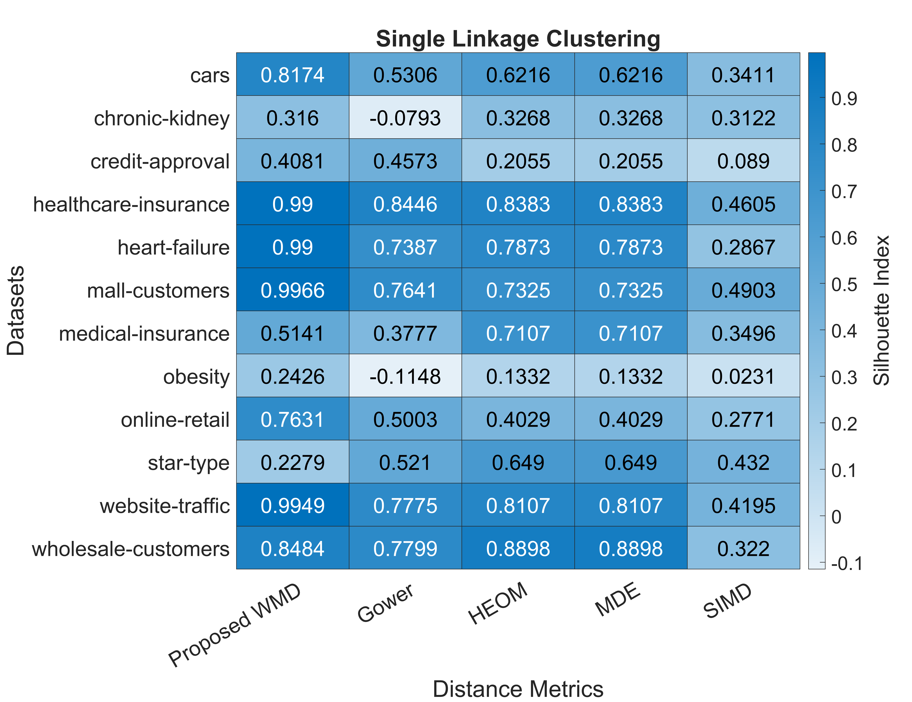
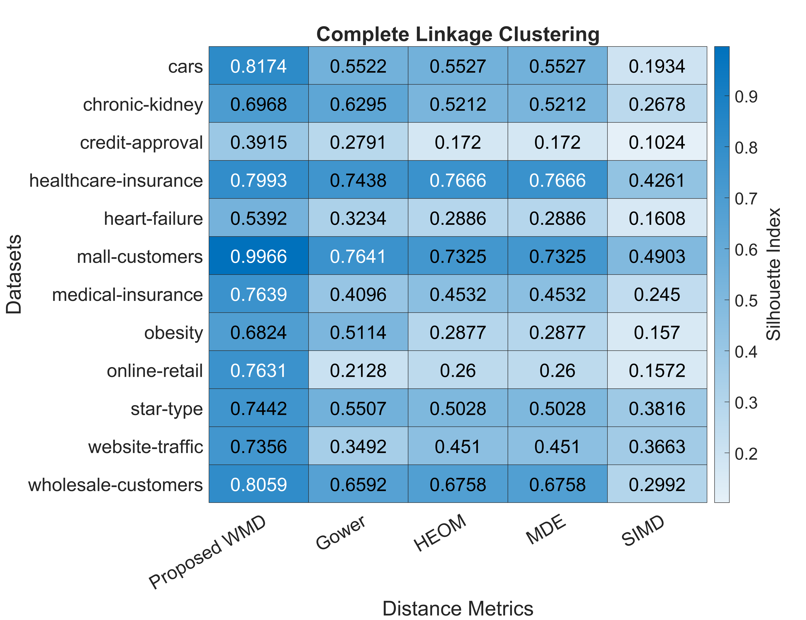
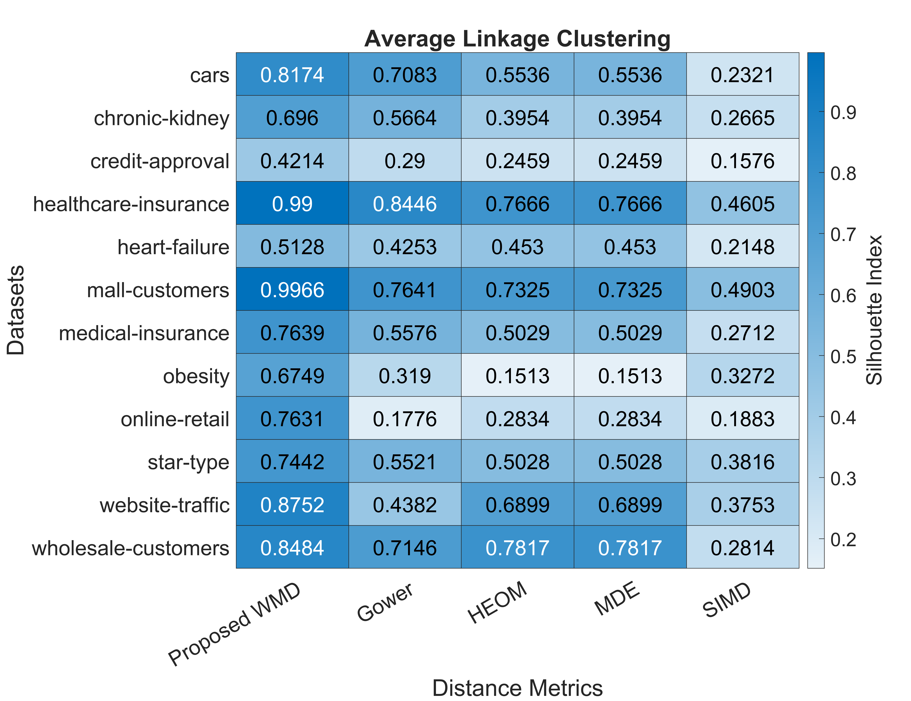
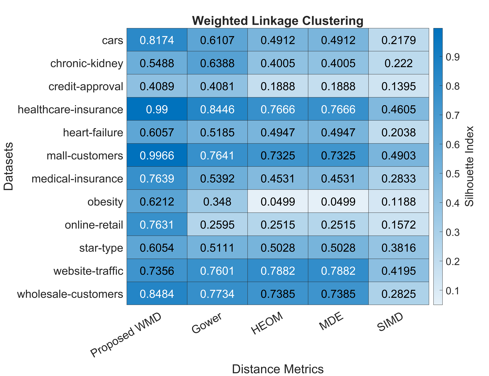

[](https://github.com/dwyl/esta/issues)

# Weighted Mixed Distance [`[paper]`](https://github.com/aungpyaeap)
Let $\mathfrak{X}^{n \times m}, m:=m_R + m_C$ be a mixed dataset. The Weighted Mixed Distance (WMD) metric is defined as

$d(x_i,x_j) = \frac{1}{m} w_R \times \sum_{k=1}^{m_R} d_{ijk} + w_C \times \sum_{k=1}^{m_C} d_{ijk}$

where $d_{ijk}:=\sqrt{1 - \frac{x_i \cdot x_j}{\Vert x_i\Vert \Vert x_j\Vert}}$ if $x_{i}$ and $x_{j}$ are numerical and $d_{ijk}:=\mathbb{I}(x_{i} \neq x_{j})$ if $x_{i}$ and $x_{j}$ are categorical, $w_R$ is the weight of numerical features and $w_C$ is the weight of categorical features.

WMD satisfies the following conditions for any three data points $(x_i,x_j,x_k)$.
1. $\forall x_i \neq x_j, d(x_i,x_j) > 0, d(x_i,x_i) = 0$
2. $d(x_i,x_j) = d(x_j,x_i)$
3. $\forall x_k, d(x_i, x_j) \leq d(x_i, x_k) + d(x_k, x_j)$

## Usage
MATLAB code `wmd(X, W_R, W_C)` function returns $n \times n$ symmetric matrix.
```m
dataPoints = readtable('medical-insurance.csv', VariableNamingRule='preserve');
epsilon = 0.5;
[weightNumerical, weightCategorical] = getweights(dataPoints, epsilon);
DIST = wmd(dataPoints,weightNumerical, weightCategorical);
disp(DIST);
```

## Experiment Results






## Citation
Pyae, A., Low, Y. C., & Chua, H. N. (2024, August). A Combined Distance Metric Approach with Weight Adjustment For Improving Mixed Data Clustering Quality. In 2024 IEEE International Conference on Artificial Intelligence in Engineering and Technology (IICAIET) (pp. 183-188). IEEE.
```bibtex
@INPROCEEDINGS{10730392,
  author={Pyae, Aung and Low, Yeh-Ching and Chua, Hui Na},
  booktitle={2024 IEEE International Conference on Artificial Intelligence in Engineering and Technology (IICAIET)}, 
  title={A Combined Distance Metric Approach with Weight Adjustment For Improving Mixed Data Clustering Quality}, 
  year={2024},
  volume={},
  number={},
  pages={183-188},
  keywords={Measurement;Refining;Clustering algorithms;Learning (artificial intelligence);Complexity theory;Optimization;Distance Metrics;Mixed Data;Hierarchical Clustering;Unsupervised Learning},
  doi={10.1109/IICAIET62352.2024.10730392}
}
```

## References
- R. Scitovski, K. Sabo, F. Martínez-Álvarez, and Š. Ungar, *Cluster analysis and applications*, 2021 ed. Cham, Switzerland: Springer Nature, 2022.
- J. C. Gower, “A general coefficient of similarity and some of its properties,” *Biometrics*, pp. 857–871, 1971.
- M. Van de Velden, A. Iodice D'Enza, and A. Markos, “Distance-based clustering of mixed data,” *Wiley Interdiscip. Rev. Comput. Stat.*, vol. 11, no. 3, p. e1456, 2019.
- H. Jia, Y.-m. Cheung, and J. Liu, “A new distance metric for unsupervised learning of categorical data,” *IEEE Trans. Neural Netw. Learn. Syst.*, vol. 27, no. 5, pp. 1065–1079, 2015.
- J. Ji, R. Li, W. Pang, F. He, G. Feng, and X. Zhao, “A Multi-View Clustering Algorithm for Mixed Numeric and Categorical Data,” *IEEE Access*, vol. 9, pp. 24913–24924, 2021.
- Z. Ning, J. Chen, J. Huang, U. J. Sabo, Z. Yuan, and Z. Dai, “WeDIV--an improved k-means clustering algorithm with a weighted distance and a novel internal validation index,” *Egypt. Inform. J.*, vol. 23, no. 4, pp. 133–144, 2022.
- U. Von Luxburg, “A tutorial on spectral clustering,” *Stat. Comput.*, vol. 17, pp. 395–416, 2007.
- S. Miyamoto, *Theory of agglomerative hierarchical clustering*, 2022 ed. Singapore, Singapore: Springer, 2022.
- L. A. Belanche Muñoz and J. Hernández González, “Similarity networks for heterogeneous data,” in *Proc. ESANN 2012*, Bruges, Belgium, pp. 215–220, Apr. 2012.
- L. AbdAllah and I. Shimshoni, “K-means over incomplete datasets using mean Euclidean distance,” in *Proc. Int. Conf. Mach. Learn. Data Mining Pattern Recogn.*, pp. 113–127, 2016.
- D. R. Wilson and T. R. Martinez, “Improved heterogeneous distance functions,” *J. Artif. Intell. Res.*, vol. 6, pp. 1–34, 1997.
- S. Alelyani, J. Tang, and H. Liu, “Feature selection for clustering: A review,” in *Data Clustering*, pp. 29–60, Chapman and Hall/CRC, 2018.
- L. Zhu, L. Miao, and D. Zhang, “Iterative Laplacian score for feature selection,” in *Proc. Pattern Recogn. CCPR 2012*, Beijing, China, pp. 80–87, Sep. 2012.
- A. Diop, N. El Malki, M. Chevalier, A. Péninou, and O. Teste, “Impact of similarity measures on clustering mixed data,” in *Proc. 34th Int. Conf. Sci. Stat. Database Manag.*, pp. 1–12, 2022.
- N. Tomašev and M. Radovanović, “Clustering evaluation in high-dimensional data,” in *Unsupervised Learning Algorithms*, pp. 71–107, Springer, 2016.
- P. J. Rousseeuw, “Silhouettes: a graphical aid to the interpretation and validation of cluster analysis,” *J. Comput. Appl. Math.*, vol. 20, pp. 53–65, 1987.
- C. Hennig, M. Meila, F. Murtagh, and R. Rocci, *Handbook of cluster analysis*, 1st ed. Chapman and Hall/CRC, 2015.
- A. Pyae, Y.-C. Low, and H. N. Chua, “A Combined Distance Metric Approach with Weight Adjustment For Improving Mixed Data Clustering Quality,” in *Proc. IEEE Int. Conf. Artif. Intell. Eng. Technol. (IICAIET)*, pp. 183–188, 2024.
- The MathWorks, Inc., *Statistics and Machine Learning Toolbox*, version 24.2.0 (R2024b), Natick, Massachusetts, United States, 2025.
- A. José-García and W. Gómez-Flores, “CVIK: A Matlab-based cluster validity index toolbox for automatic data clustering,” *SoftwareX*, vol. 22, p. 101359, 2023.
- A. Ahmad and S. S. Khan, “Survey of state-of-the-art mixed data clustering algorithms,” *IEEE Access*, vol. 7, pp. 31883–31902, 2019.
